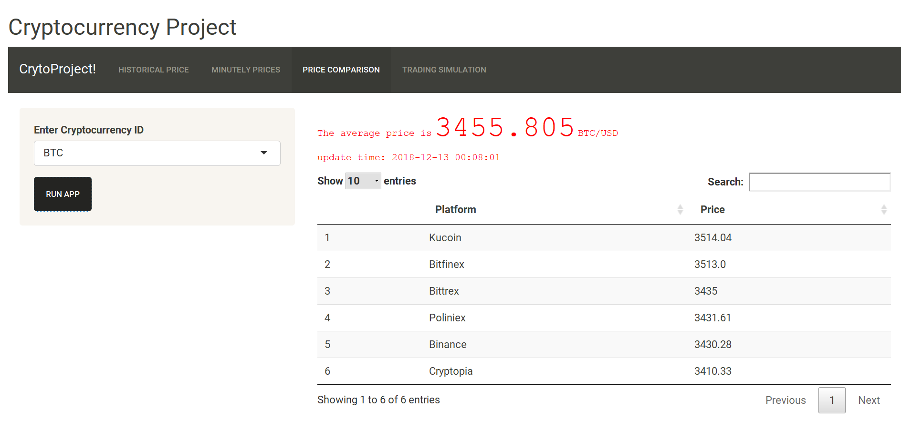
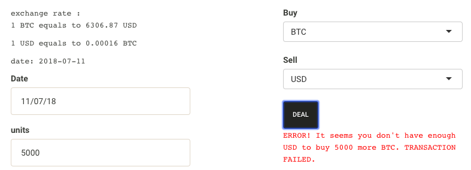

```{r}
library(CryptoShiny)
```

# Historical Data

To collect the historical data of the Cryptocurrencies, we are using the API Cryptocompare (https://www.cryptocompare.com/). Basically, this API allow us to recover this type of data:

- Hitorical data for all the cryptocurrencies in the market in different timeframes (minute, hour, and day). The information we get for each cryptocurrency is open price, close price, high price, low price and volume in the chosen timeframe. 

- General info about all the existing cryptocurrencies

- Data about all the news articles that were released about cryptocurrencies from 2013 to now.

# Functions

### Day_hour 

This function has been designed to receive the data of the desired cryptocurrency in an specific timeframe. 

It takes as inputs: 

- Timeframe: day or hour
- First day of the dataset
- Last day of the dataset
- Cryptocurrency or currency you want to analyse
- Cryptocurrency or currency to be compared with

It returns a dataframe with the date, high, low, close and open price in the timeframe, volume in the and direction (decreasing if the close price is lower than the open price, increasing otherwise).

In the following example we are obtaining the price the Bitcoin in USD, from December 1th 2017 until August 1th 2018 with a daily timeframe.

```{r}
bitcoinVsDollarExampleDay <- day_hour("day", "01/12/2017", "01/08/2018", "BTC", "USD")
head(bitcoinVsDollarExampleDay)
```

If the cryptocurrency to analyse and compare are the same, we return a dataset with all the prices equal to one and the volume equal to zero.

```{r}
exampleSameCryptocurrency <- day_hour("day", "01/12/2017", "01/08/2018", "BTC", "BTC")
head(exampleSameCryptocurrency)
```


### lastweek_minute

This function has been desiged to get the price per minute of the desired cryptocurrency in the last week. It takes as input:

- Cryptocurrency or currency you want to analyse
- Cryptocurrency or currency to be compared with

It returns a dataframe with the date, high price, low price, close price, open price and direction (decreasing if the close price is lower than the open price, increasing otherwise) in each minute of the last week. 

In the following example we are getting the price of Bitcoin in USD .

```{r}

minuteExampleBTCvsUSD <- lastweek_minute("BTC", "USD")
head(minuteExampleBTCvsUSD)

```

### Tsp_data

This function has been created to be used inside the lastweek_news_counter function. It return a dataframe with the latest 50 news about cryptocurrencies that have been publicated before the inputed time.

```{r}
actualTime <- round(as.numeric(as.POSIXct(Sys.time(), format="%Y/%m/%d")))
exampleTsp <-  Tsp_data(actualTime) 
head(exampleTsp,1)
```

### lastweek_news_counter

This function has been designed to count hourly how many times the inputted crpytocurrency has been mentioned in the news during the last week.

```{r}
countNewsLastWeekBitcoin <- lastweek_news_counter("BTC")
head(countNewsLastWeekBitcoin,1)
```


### Transfer daily or hourily data to weekly or monthly data

This function has been designed to change the timeframe hour or day into month or week. It takes as input the dataset that return the function day_hour and return one dataset with the timeframe changed.

```{r}
CryptoNewsAnalysed <-CryptoNewsOccurencesDays[c("time", "BTC")]
colnames(CryptoNewsAnalysed) <- c("date", "news")
attr(CryptoNewsAnalysed$date, "tzone") <- "GMT"
CryptoNewsAnalysed$date <- CryptoNewsAnalysed$date + 3600
bitcoinVsDollarExampleDay <-bitcoinVsDollarExampleDay %>% dplyr::left_join(CryptoNewsAnalysed, by = "date")
#------------------------To put the news columns inside the dataframe--------------------


bitcoinVsDollarExampleWeek <- weekly_monthly_transformation(bitcoinVsDollarExampleDay, "week")
head(bitcoinVsDollarExampleWeek)
```

### Averages function

This function has been designed to add financial indicators into the dataset (Moving average and MACD). It takes as input a dataset and the windows of moving average, slow MACD, quick MACD and signal MACD and returns the dataset with the financial indicators added.

```{r}
bitcoinVsDollaFinancialIndicators <- averages(bitcoinVsDollarExampleWeek, 5, 26, 12, 9)
head(bitcoinVsDollaFinancialIndicators)
```


### Crypto function

This function combines day_hour, weekly_monthly_transformation and averages into a single function.

It takes as input:

- Timeframe: day, hour, week or month
- First day of the dataset
- Last day of the dataset
- Cryptocurrency or currency you want to analyse
- Cryptocurrency or currency to be compared with
- Window moving average
- Window quick exponential moving average
- Window slow exponential moving average
- Window signal MACD

It returns a dataset with the time, highest price, lowest price, open price, close price and financial indicators in the chosen timeframe.

Example of the Bitcoin price vs USD per hour.
```{r}
exampleCryptoBTCUSDHour <- crypto("hour", "01/08/2018", "01/10/2018", "BTC", "USD",5 , 26, 12, 9)
tail(exampleCryptoBTCUSDHour)
```

### Correlation

Function to get the correlation of two cryptocurrencies between two chosen dates.

```{r}
correlationBTCvsETH <- crypto_correlation("01/09/2018", "01/10/2018", "BTC", "ETH")
print(correlationBTCvsETH)
```

### Candle Plot

An interactive plot displaying the evolution of the exchange rate between two currencies over time. Most often a cryptocurrency with another crypotcurrency/fiat currency. Particular features include a boxplot indicating the "edge" values of the exchange rate at each date -opening/closing value and highest/lowest value- as well as a colour indication on the daily progress -red for loss/ green for profit. Furthermore, density lines are exhibited; namely, the daily average and the moving average.

On a supplementary plot beneath the main plot, the chosen financial tool is exhibited. Either a barplot of the volume of the transaction over the chosen time range, or the MACD analysis results as barplot. 

The interactive character of the plot returns details for every point on the plot, as well as a slider providing the option to zoom into a subrange of the exhibited range.
  
Example with MACD:

```{r, out.width = "600px"}
candle_plot(data= exampleCryptoBTCUSDHour, MACD)
```

Example with Volume:

```{r, out.width = "600px"}
candle_plot(data= exampleCryptoBTCUSDHour, volume)
```


### Function LastWeek Plot

On this plot, the evolution of the exchange rate between two currencies is displayed for a pre-specified time interval. A real-time call returns the financial data for the current week, along with the data for the citations plot. Most often a cryptocurrency with another crypotcurrency/fiat currency is chosen for the plot. The hourly average of the exchange rate is exhibited as a scatterplot, on top of which, a statistical general additive model is implemented in order to generate a smooth density function for the displayed data. Displayed as a linear geom object.
  
Supplementary to the main plot, a barchart tool is integrated. For the chosen currency, the number of articles that cite the currency's name are displayed at a uesr-defined time-groupping -per hour, 3 hours, 6 hours, 12 hours, day. The data are provided by a selected number of online financial news sources. The purpose of this tool, implementing text mining on the news articles, is to provide information derived by non-financial means, as a general purpose indicator for predisposition of the market against the selected currency.
  

```{r, out.width = "600px"}
plot_lastweek(cryptocurrency = "EOS", comparison = "GBP", grouping = "6 hours")
```


### Function to get the last Price from Multiple Platforms

This function has been desiged to get the last price of the chosen cryptocurrencies on the 6 biggest platform. The aim is to know which platform has the lowest price.

It takes as input the criptocurrency to analyse and it returns a dataset with the price of that cryptocurrency in each platform (if avaliable).

```{r}
lastPrice <- getLastPriceMultiplePlatforms("BTC")
head(lastPrice)
```


### Function to allow trading simulation

The follwing two functions are used to do the trading simulation, which is based on the virtual pocket in following format.

```{r}
startday = "01/10/2018"
pocket_log <- data.frame("date" = as.POSIXct(startday,format="%d/%m/%Y", origin = "1970-01-01",tz = "GMT"),
                         "NetUSDvalue" = 1000,"USD" = 1000,"EUR" = 0, "GBP" = 0, "BTC" = 0, "ETH" = 0, "BNB" = 0, "BCC" = 0, "NEO" = 0, "LTC" = 0, "QTUM" = 0, "ADA" = 0, "XRP" = 0, "EOS" = 0, "TUSD" = 0, "IOTA" = 0, "XLM" = 0, "ONT" = 0, "TRX" = 0, "ETC" = 0, "ICX" = 0, "VEN" = 0, "NULS" = 0, "VET" = 0, "PAX" = 0)
head(pocket_log)
```

### Transaction

This function takes pocket_log as input and several transaction parameters and returns a pocket_log with one added line in the end of the dataframe indicating the assets of the virtual pocket after transaction.

For example:

```{r}
pocket_log <- transaction(pocket = pocket_log, unit = 0.02, buycurrency = "BTC", sellcurrency = "USD", day = "05/12/2018")
pocket_log <- transaction(pocket = pocket_log, unit = 0.002, buycurrency = "BNB", sellcurrency = "USD", day = "07/12/2018")
pocket_log <- transaction(pocket = pocket_log, unit = 100, buycurrency = "EUR", sellcurrency = "USD", day = "10/12/2018")
pocket_log
```

This function also included the option of shortselling the assets. It can be accessed by setting (allowNegative == TRUE), for example:

```{r}
pocket_log <- transaction(pocket = pocket_log, unit = 100, buycurrency = "EUR", sellcurrency = "ETH", day = "10/12/2018", allowNegative = TRUE)
pocket_log
```

We have implemented some robustness settings:

1. if unit input is 0, return original pocket_log
2. if allowNegative == FALSE, the transaction that make the asset unit becomes negative will not recorded.
3. if the exchange rate of two currencies is zero, return original pocket_log

### NetUSDValue

This function is used to calculate the net value of one pocket in a gived date, having following format:

```{r}
pocket <- c("USD" = 1000, "BTC" = 10, "ETH" = 5)
NetUSDValue(pocket = pocket, day = "11/12/2018" )
```

To access the net value in the pocket_log after the latest transaction, we can use following format:

```{r}
NetUSDValue(pocket = as.list(pocket_log[nrow(pocket_log),]),
            day = pocket_log[nrow(pocket_log),1] )
```
or equivalently,
```{r}
pocket_log[nrow(pocket_log),2]
```

# News

The cryptocompare API gives us access to data about all the news articles that were released about cryptocurrencies from 2013 to now. Our goal is to interpret this news to see the evolution of the popularity of different cryptocurrencies during time.

For this, we want to analyse how many time any cryptocurrency was mentioned in the news, each hour and each day.

First we will try to download all the articles, their text body and the time each one was released. This first dataframe is huge and we will only keep the analysed ones.

### Getting the whole CryptoNewsData set 

This dataset stores all the news articles about cryptocurrencies released from 2013-08-01 18:30:00 that CryptoCompare API proposes

Here we download the dataset and store it to a csv file with dl_data_news function
```{r}
#data <- dl_data_from(as.numeric(as.POSIXct("2013-11-25 1:00:00 EST")))
#write.csv(data, "CryptonewsData.csv")
```

### Analysing the dataset for plots data

We load the dataset from csv, as the dl_data_from function would take too much time, so we run it only once.

Here the time is modelised by the timestamp, which is a very useful and can be converted into a date and precise hour: https://www.unixtimestamp.com/

```{r}
head(CryptonewsData)
```

We want to analyse the occurences of the 20 most capitalized cryptocurrencies; so we download the list of these cryptocurrencies symbols using get_imp_Crp function.

Here we removed some the 20 currencies that were not available in our crypto dictionary.

```{r}
#interesting_crypto <- get_imp_Crp()
#interesting_crypto
```

This vector of cryptocurrencies symbol will be translated into the name of each cryptocurrency by the function CryptoCurrencyName.
This function uses the data from a "Radiovisual" github: "https://github.com/crypti/cryptocurrencies/blob/master/cryptocurrencies.json)"

```{r}
CryptoCurrencyName("BTC")
CryptoCurrencyName("ETH")
```

By using CryptoCurrencyName dictionary, the function analyse_crps_news will verify if the each cryptocurrency was mentioned in those news articles.

We analyse the news dataset based on the cryptocurencies we chose: we have a dataframe showing which articles mentions each cryptocurrency.

```{r}
# interesting_crypto <- c("BTC", "ETH", "LTC", "XMR", "USDT")
# result <- analyse_crps_news(CryptonewsData[seq(1,500,1),], interesting_crypto)
# head(result)
```

Finally; we sum the occurences of each cryptocurrency per hour and per day for plotting; using the functions resTspToHour and resTspToDay.

We then write them in csvs file to create the two datasets CryptoNewsOccurencesHour and CryptoNewsOccurencesDay

```{r}
# finalHour <- resTspToHour(result, interesting_crypto)
# write.csv(finalHour, "CryptoNewsOccurencesHour.csv")
# head(finalHour)
# finalDay <- resTspToDay(result, interesting_crypto)
# write.csv(finalDay, "CryptoNewsOccurencesDays.csv")
# head(finalDay)
```

To make sure these datasets stay up to date for live usage, we can update them with the following functions: This updates the raw data in the folder raw-data.

```{r}
# updateHourNewsData()
```

```{r}
# updateDayNewsData()
```

# Shiny App

The user interface was designed and implemented as a shiny application. The navbar page layout was preferred, such that a dedicated page would be provided for each main functionality of the package. The current version of the package includes the tabs below:
  
  - HISTORICAL PRICE
  
  - MINUTELY PRICES
  
  - PRICE COMPARISON
  
  - TRADING SIMULATION
  
### Historical Price

The introductory, and basic, tab of the application, where the historical data are displayed. The side bar provides the utilities for the user. There, the parameters for the currencies and the timeframe to be displayed are passed on. Moreover, the parameters for the financial analysis as well as the supplementary tools are inserted. The candle_plot object is returned and the combined plot is displayed.
For example:
```{r, out.width = "600px"}
knitr::include_graphics("historical_1.png")
```
Some robustness settings: 

1. The red text part is the latest exchange rate of the selected currencies, automatically updating every ten seconds. 
2. When a user choose a date range, the timeframe will automatically adapt to be sure the best display quality. Following are the rule of the adaptation.
  (a) If the timerange is larger than 24 months, we recommend "month", and options are "month", "week", "day"
  (b) If the timerange is larger than 24 weeks but smaller than 24 months, we recommend "week", and options are  "week", "day"
  (c) If the timerange is larger than 24 days but smaller than 24 weeks, the only options is "day".
  (d) If the timerange is smaller than 24 days, the only option is "hour"
  
  The choice of n = 24, is due to the display quality and the conviction of the MACD indicator, in which the window of EMA is 24.
  
3. When a user choose a timeframe, the parameters of the MACD will also automatically update to prevent the window size larger than the data points in the dataframe. The constraint is this paramters should not larger than the amount of data points minus five.
  
  
### Price by minute

On a similar fashion, an updated version of the data, for the current week, is displayed on this tab. The data are called in real-time, according to the user's choices on the corresponding side bar. The plot_lastweek object is returned and the combined plot is displayed.
```{r, out.width = "600px"}
knitr::include_graphics("minute_1.png")
```


Robustness setting:
Since it takes a lot of time to load, process, display the data, we add a loading sign when the plot is loading. For example,
```{r, out.width = "600px"}
knitr::include_graphics("minute_2.png")
```

  
### Price Comparison

The tab to providing information on the current exchange rate for the chosen currency. The currency is input on a side bar and the data are retrieved in real-time from the available set of platforms and provided on a tabular form, along with the average rate over all platforms.

Robustness setting:
If the price information of selected cryptocurrency is not available on some platforms, it display a blank (NA).

```{r, out.width = "600px"}

```
  
  
### Trading Simulation

The tab providing the trading simulator. The user input on the chosen timeframe, the initial budget and the trading information are given on top, along with an action button to implement a deal. After initialization, the user can view the past activities on the ledger below. Finally, the evolution of the net value for all the currencies invested is exhibited on a separate plot.

In order to do a trading simulation, you need to 

1. first choose the starting date of the simulation and the amount of US dollars you want to put inside the pocket and click initial.

2. You can choose a date you want to make a deal, the currencies you want to buy and sell and the amount of the currency you want to buy.

3. After choosing these parameters, the exchange rate of two selected currencies will update. When you are sured you want to make a deal, click "Deal" to make a transaction.

4. After clicking deal, if the transaction is successful, the pocket_log will be updated, the new transaction will be recored in the new line of the table.

5. You can check the net value in the pocket in the date you make the transaction, and the evolution of the net value can be read on the plot.

6. If you want to initial the simulation, click "initial"

```{r, out.width = "600px"}
knitr::include_graphics("trading_1.png")
```
```{r, out.width = "600px"}
knitr::include_graphics("trading_2.png")
```
  
Some robustness settings:

1. Aftering choosing the starting date, the transaction date can only range from the same or the day after.
2. Once one transaction is made, the next transaction date can only range from the same or the day after.
3. If user buy more than he could, display the error message and the transaction is not recorded. For example,
```{r, out.width = "600px"}

```

4. If in the selected transaction date, the currency was not yet available, return a warning message on the exchange rate. And if clicking the "DEAL", return a error message, and the transaction is not recorded. For example,
```{r, out.width = "600px"}
knitr::include_graphics("trading_4.png")
```

5. If the units is setted be zero and the user click "DEAL", return error. For example,
```{r, out.width = "600px"}
knitr::include_graphics("trading_5.png")
```  
  

