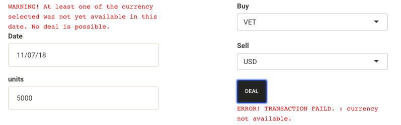

```{r}
library(CryptoShiny)
```

###Function part
Following two introduced functions is used to do the trading simulation, which is based on the virtual pocket in following format.
```{r}
startday = "01/10/2018"
pocket_log <- data.frame("date" = as.POSIXct(startday,format="%d/%m/%Y", origin = "1970-01-01",tz = "GMT"),
                         "NetUSDvalue" = 1000,"USD" = 1000,"EUR" = 0, "GBP" = 0, "BTC" = 0, "ETH" = 0, "BNB" = 0, "BCC" = 0, "NEO" = 0, "LTC" = 0, "QTUM" = 0, "ADA" = 0, "XRP" = 0, "EOS" = 0, "TUSD" = 0, "IOTA" = 0, "XLM" = 0, "ONT" = 0, "TRX" = 0, "ETC" = 0, "ICX" = 0, "VEN" = 0, "NULS" = 0, "VET" = 0, "PAX" = 0)
pocket_log %>% head()
```

#First function: transaction

This function takes pocket_log as input and serval transaction parameters and outputs a pocket_log with one added line in the end of the dataframe indicating the assets of the virtual pocket after transaction. For example:

```{r}
pocket_log <- transaction(pocket = pocket_log, unit = 0.02, buycurrency = "BTC", sellcurrency = "USD", day = "05/12/2018")
pocket_log <- transaction(pocket = pocket_log, unit = 0.002, buycurrency = "BNB", sellcurrency = "USD", day = "07/12/2018")
pocket_log <- transaction(pocket = pocket_log, unit = 100, buycurrency = "EUR", sellcurrency = "USD", day = "10/12/2018")
pocket_log
```
This function also included the option of shortselling the assets. It can be accessed by setting (allowNegative == TRUE), for example:
```{r}
pocket_log <- transaction(pocket = pocket_log, unit = 100, buycurrency = "EUR", sellcurrency = "ETH", day = "10/12/2018", allowNegative = TRUE)
pocket_log
```
Some robustness settings:

1. if unit input is 0, return original pocket_log
2. if allowNegative == FALSE, the transaction that make the asset unit becomes negative will not recorded.
3. if the exchange rate of two currencies is zero, return original pocket_log

#Second function: NetUSDValue
This function is used to calculate the net value of one pocket in a gived date, which having following format:
```{r}
pocket <- c("USD" = 1000, "BTC" = 10, "ETH" = 5)
NetUSDValue(pocket = pocket, day = "11/12/2018" )
```
To access the net value in the pocket_log after the latest transaction, we can use following format:
```{r}
NetUSDValue(pocket = as.list(pocket_log[nrow(pocket_log),]),
            day = pocket_log[nrow(pocket_log),1] )
```
or equivalently,
```{r}
pocket_log[nrow(pocket_log),2]
```

###Shiny App part

#Fourth tab: Trading Simulation

In order to do a trading simulation, you need to 

1. first choose the starting date of the simulation and the amount of US dollars you want to put inside the pocket and click initial.

2. You can choose a date you want to make a deal, the currencies you want to buy and sell and the amount of the currency you want to buy.

3. After choosing these parameters, the exchange rate of two selected currencies will update. When you are sured you want to make a deal, click "Deal" to make a transaction.

4. After clicking deal, if the transaction is successful, the pocket_log will be updated, the new transaction will be recored in the new line of the table.

5. You can check the net value in the pocket in the date you make the transaction, and the evolution of the net value can be read on the plot.

6. If you want to initial the simulation, click "initial"

```{r, out.width = "400px"}
knitr::include_graphics("trading_1.png")
```
```{r, out.width = "400px"}
knitr::include_graphics("trading_2.png")
```

Some robustness settings:

1. Aftering choosing the starting date, the transaction date can only range from the same or the day after.
2. Once one transaction is made, the next transaction date can only range from the same or the day after.
3. If user buy more than he could, display the error message and the transaction is not recorded. For example,
```{r, out.width = "400px"}
knitr::include_graphics("trading_3.png")
```

4. If in the selected transaction date, the currency was not yet available, return a warning message on the exchange rate. And if clicking the "DEAL", return a error message, and the transaction is not recorded. For example,
```{r, out.width = "400px"}

```

5. If the units is setted be zero and the user click "DEAL", return error. For example,
```{r, out.width = "400px"}
knitr::include_graphics("trading_5.png")
```

